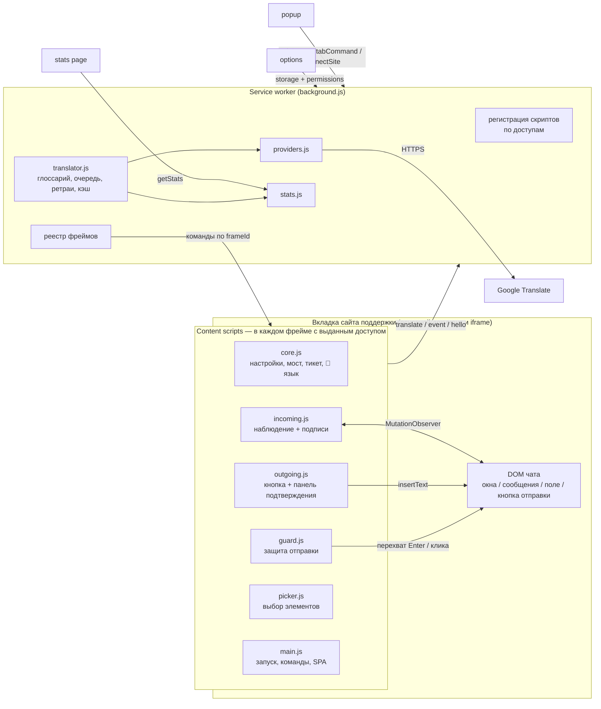

# 02. Архитектура (v0.2)

## Общая схема



## Компоненты

### `lib/` — общий код (без import/export, всё в `globalThis`)

| Файл | Где выполняется | Ответственность |
|---|---|---|
| `defaults.js` | везде | Настройки по умолчанию (`DEFAULTS`, `SITE_DEFAULTS`), языки и их названия, нормализация кодов, письменность языка/текста (`langScript`, `textScript`), glob-матчинг URL, вывод доменов доступа из правила (`ruleOrigins`), хэш, дата |
| `providers.js` | SW | `google-free` (POST gtx, `dj=1`) и `google-cloud` (v2) за единым интерфейсом |
| `glossary.js` | SW, options | Разбор глоссария; `protect()` заменяет термины метками `⟦n⟧`, `restore()` возвращает (проверено: Google сохраняет метки в es/tr/de/ar/zh/ru) |
| `translator.js` | SW | Глоссарий → кэш (L1 Map + L2 `storage.session`, ключ включает хэш глоссария) → дедупликация → семафор 4 → ретраи → разбиение → фолбэк free→cloud → статистика |
| `stats.js` | SW | Дневные записи в `statsDays`, последовательная запись, дедупликация входящих по хэшу, срок хранения |

### `background.js` — service worker

- **Регистрация скриптов.** `chrome.scripting.registerContentScripts` c `matches` = домены всех правил, к которым выдан доступ; `allFrames: true`, `matchOriginAsFallback: true`. Пересчёт при изменении правил, выдаче/отзыве доступа, старте браузера; в уже открытые вкладки — `executeScript`. Перерегистрация только если набор доменов изменился.
- **Подключение сайта.** Popup сохраняет `pendingConnect` в `storage.session` и вызывает `permissions.request`; завершение (создание правила, регистрация, внедрение) — в SW, последовательно (popup может закрыться во время диалога).
- **Реестр фреймов.** Каждый content script шлёт `hello` → SW запоминает `frameId` вкладки. Команды popup и горячие клавиши рассылаются во все фреймы; неотвечающие удаляются из реестра.
- **Сообщения:** `translate`, `hello`, `event`, `pickEnd`, `tabStatus`, `tabCommand`, `connectSite`, `syncScripts`, `getSettings`, `getStats`, `resetStats`, `clearCache`.

### `content/` — скрипты страницы (общий объект `ST`)

| Файл | Ответственность |
|---|---|
| `core.js` | Настройки и правило сайта; мост к SW (`send`, `translate`, `track`); `alive()` — синхронное обнаружение перезагрузки расширения; CLD; `ticketKey()` (селектор ID тикета или URL); `langLock` (📌 язык тикета, 300 последних); `expectedLang()` = 📌 → язык последнего сообщения собеседника; DOM-утилиты, вставка текста |
| `incoming.js` | Observer → сообщения в окнах → хэш → CLD → перевод → подпись (`inside` — внутрь, `after` — соседним узлом, с чисткой «сирот»); `lastForeignLang()` учитывает `userMessageSelector` / `operatorLangs`; событие статистики |
| `outgoing.js` | Кнопка у поля (показывает язык и 📌); панель подтверждения; чекбокс 📌; запоминание вставленного перевода (для защиты); событие статистики |
| `guard.js` | Перехват в фазе capture на `window`: Enter/Ctrl+Enter/Shift+Enter (по `sendKey`) и клик по `sendButtonSelector`; проверка; предупреждение; повтор отправки (синтетический Enter или `button.click()`) |
| `picker.js` | Выбор окна, сообщения, поля, кнопки отправки, ID тикета; отмена во всех фреймах, когда выбор сделан в одном |
| `main.js` | Применение настроек, команды (действует фрейм с фокусом), статус для popup, SPA-навигация |

### Страницы расширения
- `popup/` — подключение сайта, статус по фреймам, пикеры, статистика за сегодня.
- `options/` — все настройки, статус доступа по правилам, глоссарий с проверкой, импорт/экспорт.
- `stats/` — статистика за 7/30/90 дней, экспорт, объединение файлов коллег.

## Модель данных

`chrome.storage.local`:
```jsonc
{
  "settings": {
    "enabled": true,
    "targetLang": "en", "skipLangs": ["en"],
    "displayMode": "below", "minChars": 3,
    "fallbackOutgoingLang": "es", "backTranslateLang": "auto", "outgoingButton": true,
    "operatorLangs": ["ru"],        // не считаются языком собеседника
    "guardMinLetters": 8,           // короче — не проверяем при отправке
    "glossary": "Premium Plus\nКошелёк => ru: Кошелёк | es: Billetera",
    "provider": "google-free", "googleCloudApiKey": "", "fallbackToCloud": true,
    "statsKeepDays": 90,
    "sites": [{
      "id": "site-xxx", "name": "Support desk", "enabled": true,
      "urlPattern": "https://desk.example.com/*, https://chat.vendor.com/*",  // страница и/или iframe
      "origins": "",                           // доп. домены доступа (match patterns)
      "containerSelector": "#chat-messages",
      "messageSelector": ".msg-text",
      "userMessageSelector": ".msg.in",        // сообщения пользователя
      "inputSelector": "#composer",
      "sendButtonSelector": "#send",
      "sendKey": "auto",                       // auto | enter | ctrl+enter | shift+enter | none
      "ticketIdSelector": ".ticket-id",
      "insertMode": "inside",                  // inside | after
      "sendGuard": true,
      "lastOutgoingLang": "tr"
    }]
  },
  "langLocks": { "desk.example.com|Ticket #2": { "lang": "de", "at": 1758100000000 } },
  "statsDays": { "2026-09-17": { "requests": 0, "chars": 0, "cacheHits": 0, "errors": 0, "lastError": "",
                                 "providers": {}, "incoming": { "es": { "n": 0, "chars": 0 } }, "outgoing": {},
                                 "guard": { "blocked": 0, "sentAsIs": 0, "translated": 0 } } },
  "statsSeen": { "date": "2026-09-17", "list": ["<hash>"] }
}
```
`chrome.storage.session` (только SW и страницы расширения): `c:<hash>` — кэш переводов; `frames:<tabId>`; `registeredKey`; `pendingConnect`.

DOM: `data-st-done`, `data-st-lang`, наши узлы — `data-st-ui` (`tr`, `err`, `panel`, `guard`, `fab`, `toast`, `pick`).

## Модель доступа (безопасность)

| Что | Как |
|---|---|
| Сеть | Только `translate.googleapis.com` и `translation.googleapis.com` (обязательные разрешения) |
| Сайты | `optional_host_permissions: *://*/*` — ни одного сайта по умолчанию. Доступ к конкретному домену выдаётся явно (popup / настройки) и отзывается в `chrome://extensions` |
| Установка | Предупреждения Chrome при установке — только о сервисах перевода, не «читает все сайты» |
| Данные | Перевод вставляется через `textContent`; API key не экспортируется; статистика и настройки локальны |

## Ключевые решения

| Решение | Почему | Когда пересмотреть |
|---|---|---|
| Защита отправки: быстрый путь по письменности + асинхронная проверка с повтором отправки | Кириллица→латиница ловится мгновенно без сети; для es/en нужен детектор, поэтому отправка блокируется и повторяется синтетически | Если сайт не принимает синтетический Enter — задать `sendButtonSelector` (повтор через клик по кнопке) |
| Язык собеседника = последнее сообщение **пользователя** | Сообщения оператора «как есть» не должны менять язык ответа | — |
| Метки `⟦n⟧` для глоссария | Проверено: Google их не трогает; не нужен HTML-режим | Если качество грамматики вокруг термина страдает — формат «термин в кавычках» |
| Статистика локально + объединение файлов | Без сервера и без передачи данных третьим сторонам | v1.0 — централизованный сбор, если нужен онлайн-дашборд |
| Реестр фреймов через `hello` вместо `webNavigation` | Не требует разрешения «читать историю браузера» | — |
| Нет сборки (чистый JS) | Любой может править и загружать распакованным | При росте — Vite + TypeScript |
