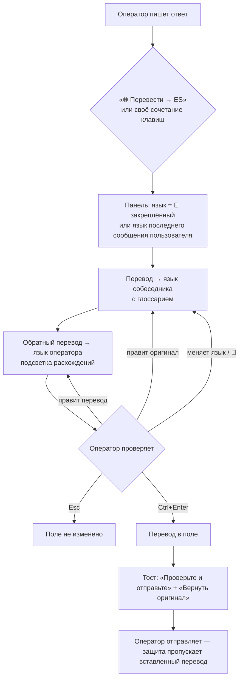
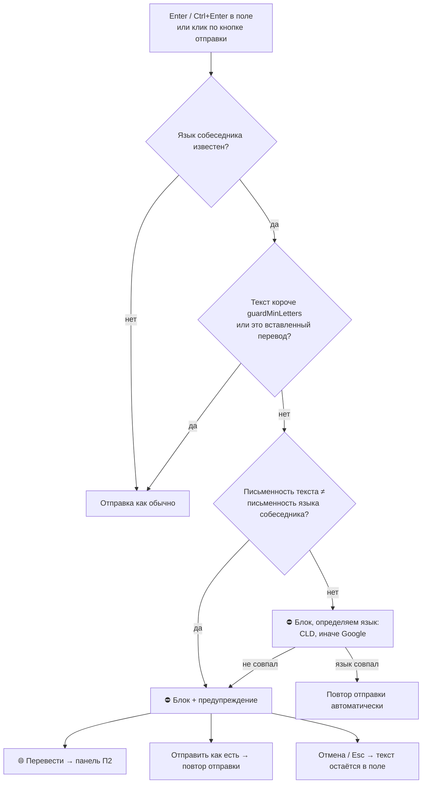

# 03. Процессы (v0.2)

## П1. Входящее сообщение

```mermaid
sequenceDiagram
  participant Site as Сайт (DOM)
  participant Inc as incoming.js
  participant SW as Service worker
  participant G as Google
  Site->>Inc: изменение DOM (новое сообщение / смена тикета)
  Inc->>Inc: debounce 250 мс → найти сообщения в окнах
  Inc->>Inc: хэш текста == data-st-done? → пропуск
  Inc->>Inc: нет букв / < minChars → пропуск
  Inc->>Inc: CLD уверенно «en» → пропуск (без сети)
  Inc->>SW: translate(text, auto → en)
  SW->>SW: глоссарий → метки ⟦n⟧; кэш? → ответ сразу
  SW->>G: POST (очередь ≤4, ретраи)
  G-->>SW: перевод + detectedLang
  SW->>SW: метки → термины; статистика
  SW-->>Inc: результат
  Inc->>Inc: detectedLang = en или перевод == оригинал → пропуск
  Inc->>Site: подпись «🌐 Переведено: X → Английский» (внутрь или после сообщения)
  Inc->>SW: event incoming (язык, символы) → статистика
```

Правила:
- Сообщение переводится один раз; изменился текст — перевод обновляется.
- При ошибке — плашка «Перевод не удался» с «повторить».
- Смена языка/режима/селекторов/глоссария → подписи перестраиваются.
- Сообщения оператора на иностранном языке тоже подписываются (видно, что ушло пользователю), но на язык собеседника не влияют.

## П2. Исходящее сообщение (с подтверждением)



### Как определяется язык собеседника
1. 📌 Закреплённый язык тикета.
2. Язык последнего переведённого сообщения **пользователя** в текущем окне (по `userMessageSelector`; если не задан — последнее сообщение не на языке операторов `operatorLangs`).
3. Последний иностранный язык на вкладке.
4. Последний выбранный язык для сайта.
5. `fallbackOutgoingLang`.

Для защиты отправки используются только пункты 1–2: если язык собеседника неизвестен — защита не вмешивается.

## П3. Защита от отправки непереведённого текста



Примечания:
- «Повтор отправки» — синтетический Enter в поле; если сайт его не обработал и задан `sendButtonSelector` — клик по кнопке.
- Все случаи пишутся в статистику: `blocked`, `sentAsIs`, `translated`.
- Отключается per-site (`sendGuard`) — например, для внутренних чатов.

## П4. Подключение нового сайта (тимлид, ~10 минут)

1. Открыть рабочий сайт с открытым тикетом на иностранном языке.
2. Иконка расширения → **Подключить этот сайт** → «Разрешить». Создаётся правило `https://домен/*`.
3. Popup → **1. Окно чата** → клик по области сообщений.
4. **2. Сообщение** → клик по тексту сообщения пользователя (тост: сколько найдено ≈ число сообщений).
5. **3. Поле ввода** → клик по полю ответа.
6. **4. Кнопка отправки** → клик по кнопке.
7. **5. ID тикета** → клик по номеру тикета в шапке.
8. Настройки → правило → при необходимости указать **Сообщение пользователя** (класс, отличающий входящие, например `.message--incoming`), **Отправка с клавиатуры**.
9. Если чат в iframe — см. [04-setup-guide.md](04-setup-guide.md#если-чат-в-iframe).
10. Проверить по [05-testing.md](05-testing.md) → **Экспорт** → раздать файл.

## П5. Обработка ошибок

| Ситуация | Поведение |
|---|---|
| Сеть / 5xx / 429 | 3 ретрая с экспоненциальной задержкой |
| Бесплатный Google недоступен | Если есть ключ и `fallbackToCloud` — Cloud API; в статистике «фолбэк» |
| Ошибка без фолбэка | Входящие: плашка «повторить»; панель: красная строка, «Вставить» неактивна; защита: предупреждение (можно «Отправить как есть») |
| Неверный селектор | Правило игнорирует этот селектор, в консоли `[SupportTranslator] Неверный …`; настройки с невалидным селектором не сохраняются |
| Нет доступа к домену | Скрипты не работают; popup — «Подключить этот сайт»; настройки — «⚠ Нет доступа» + «Выдать доступ» |
| Расширение обновили, вкладка старая | Старые скрипты отключаются (в т.ч. защита), тост «обновите страницу (F5)» |
| Сайт «ломается» от подписей внутри сообщений | Правило → «Куда вставлять перевод» → «После сообщения» |

## П6. Сбор статистики и отчёт

1. Каждый оператор: popup → «Статистика» → **Экспорт JSON** (раз в неделю / по запросу).
2. Тимлид: «Статистика» → **+ Файлы коллег (JSON)** → выбрать все файлы → цифры по команде.
3. Что смотреть: языки (нужны ли шаблоны), символы/мес и оценка стоимости официального API, доля блокировок «как есть» (оператор игнорирует защиту?), ошибки.
4. **Экспорт CSV** — для Excel/Google Sheets.

## П7. Разработка и выпуск версии

1. Правки в `extension/` → `chrome://extensions` → ⟳ → F5 на вкладке.
2. Быстрая проверка без установки: `tools/serve.ps1` → `mock-chat.html?harness=1`, `mock-iframe.html?harness=1`, `stats-preview.html`.
3. Прогнать [05-testing.md](05-testing.md).
4. Поднять `version`, дописать `CHANGELOG.md` (semver: исправления — patch, функции — minor).
5. `tools/release.ps1` → `versions/vX.Y.Z/` + zip.
6. Раздать zip команде.

## П8. Откат
Сделать **Экспорт** настроек → взять `versions/vX.Y.Z/` → в `chrome://extensions` удалить текущую и загрузить эту папку → **Импорт** настроек → выдать доступ к сайтам. (У распакованного расширения ID зависит от пути к папке — при смене папки настройки и доступы не переносятся.)
